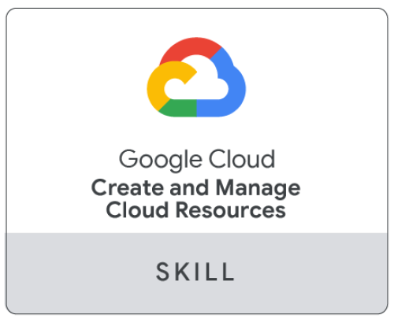
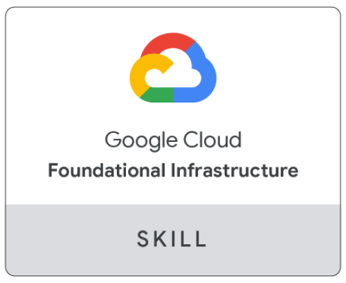
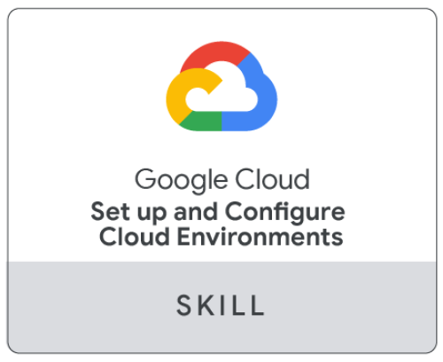

# Hello, World! 👋

My name is Nasseredine Bajwa and I'm a Cloud Data Engineer. I live in France and I'm currently seeking opportunities in the field of Cloud Engineering, Data Engineering, or Data Science.

I am currently working on completing the Data Engineering Nanodegree from Udacity and getting ready to certify as an Associate Cloud Engineer on Google Cloud Platform.

You can find me on .

## Google Cloud Skill Badges

You can view my full Qwiklabs public profile here .

### Cloud infrastructure

  
  
  

<!--
**nasseredine/nasseredine** is a ✨ _special_ ✨ repository because its `README.md` (this file) appears on your GitHub profile.

Here are some ideas to get you started:

- 🔭 I’m currently working on ...
- 🌱 I’m currently learning ...
- 👯 I’m looking to collaborate on ...
- 🤔 I’m looking for help with ...
- 💬 Ask me about ...
- 📫 How to reach me: ...
- 😄 Pronouns: ...
- ⚡ Fun fact: ...
-->
