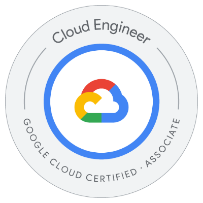

# Hello, World! 👋

My name is Nasseredine Bajwa and I live in France 🇫🇷.
As a freelance Cloud DevOps Engineer, I help businesses deploy and manage their workloads at scale on Google Cloud with Kubernetes and modern automation (CI/CD, GitOps) with security and FinOps integrated at the architecture design stage.

🗓 Available ASAP  
💻 Remote work with occasional travel  
🅠Certified Google Cloud â˜ï¸ ACE, Certified Kubernetes and Cloud Native ∠KCNA and CKA  

## Skills

### Core

  
  
  
  
  
  
  
  
  

### Currently learning

  

## Certification badges

### Linux Training Foundation

  

    
     
  

### Google Cloud

  

    
  

  

    
    
  

